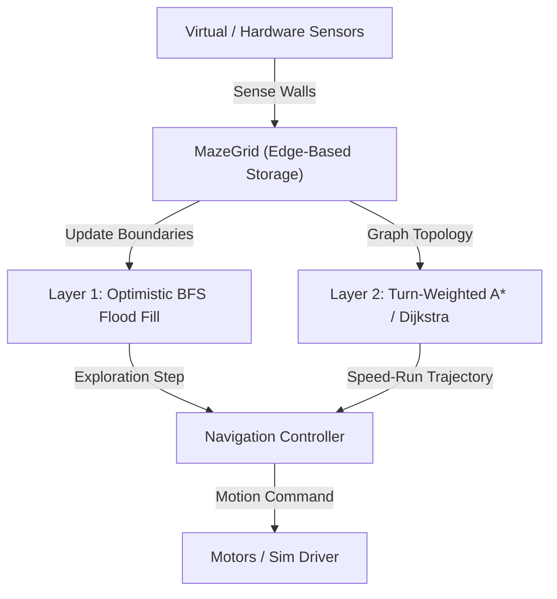

# Maze-Solver — MMRC26 Autonomous Micromouse Engine

> High-performance, deterministic maze solver engine and simulator for the 2026 HTU Micromouse Competition (MMRC26).

## Why It Exists

In the MMRC26 competition, final standing is governed by:

$$\text{Final Score} = \left(\frac{\text{Total Number of Successful Runs}}{\text{Official Time}}\right) \times 1000$$

With a continuous 8-minute (480-second) match window and an **Island Goal** configuration (where outer walls are completely detached from the center), traditional wall-following algorithms fail catastrophically. This repository provides a deterministic, two-layer algorithmic engine designed to:
1. Guarantee maze completion during the search run using **Optimistic Edge-Based Base Flood Fill**.
2. Compute the fastest physical trajectory using **Turn-Weighted State-Space Planning (Dijkstra / A\*)**.
3. Maximize repeat successful runs safely within the match time budget.
4. Maintain a strictly decoupled, zero-hardware-dependency architecture ready for direct embedded C/C++ porting.

## Quickstart

Get running in under 2 minutes:

```bash
# Clone and enter directory
cd Maze-Solver

# Run test suite
pytest -v

# Run lint and type checks
ruff check .
mypy maze_solver tests
```

## Commands

| Command | Action |
|---|---|
| `pytest -v` | Run full test suite with verbose output |
| `pytest --cov=maze_solver` | Run test coverage report |
| `ruff check .` | Run linter across all source files |
| `ruff format --check .` | Check formatting compliance |
| `ruff format .` | Auto-format Python code |
| `mypy maze_solver tests` | Run static type checker in strict mode |

## Architecture



### Directory Structure

```text
Maze-Solver/
├── firmware/                # Zero-allocation C99 embedded firmware (<2 KB SRAM)
│   ├── include/             # Headers (fixed_maze.h, floodfill.h, planner.h, kinematics.h)
│   ├── src/                 # Pure C99 implementations
│   └── tests/               # C test suite (test_firmware.c)
├── maze_solver/
│   ├── core/                # Pure navigation & algorithmic logic
│   │   ├── types.py         # Value types (Cell, Direction, Command)
│   │   ├── maze_grid.py     # Edge-based wall storage (single truth)
│   │   ├── floodfill.py     # Layer 1 Base Flood Fill
│   │   ├── planner.py       # Layer 2 Turn-Weighted A* Planner
│   │   ├── kinematics.py    # F1 Physics & Vacuum Suction Downforce
│   │   ├── diagonal_planner.py # 45° Diagonal Sprints ("Fosbury Flop")
│   │   ├── return_explorer.py  # Return-Trip Corridor Mapping
│   │   ├── sensor_filter.py # Hysteresis & EMA Analog IR/ToF Filter
│   │   └── recovery.py      # Stall/Slip Detection & Re-centering State Machine
│   ├── dashboard/           # Interactive Web UI & HTML5 Canvas visualizer
│   └── simulator/           # Virtual environment & noise injection
├── tests/                   # 38 pytest suites covering 87% codebase
├── docs/                    # Architectural design records and rules
│   ├── READINESS_CHECKLIST.md # Official 16-point MMRC26 readiness audit
│   └── MMRC26_MASTER_PLAN.md  # Comprehensive tournament master plan
└── .github/workflows/       # Automated CI pipeline
```

## Interactive Web Dashboard

Launch the browser dashboard with real-time maze editing, distance heatmap, diagonal trajectory visualization, and 480s match simulation:

```bash
python -m maze_solver.dashboard
```

## Embedded C99 Firmware (STM32 / RP2040)

To compile and run the embedded C test suite:

```bash
cd firmware
make
# Or directly with gcc:
gcc -fuse-ld=bfd -std=c99 -Wall -Wextra -Werror -pedantic -O2 -Iinclude src/*.c tests/test_firmware.c -o build/test_firmware.exe -lm
./build/test_firmware.exe
```

## Official 16-Point Readiness Checklist

Full compliance with all 16 MMRC26 rules and advice items is audited in [docs/READINESS_CHECKLIST.md](docs/READINESS_CHECKLIST.md), covering:
- **Eligibility**: Student enrollment, $\le 3$ members, single mouse, 5-minute technical defense script.
- **The Robot**: $25\text{ cm} \times 25\text{ cm}$ footprint, autonomous onboard power/logic, no combustion, wall preservation, $18\text{ cm}$ cell turning.
- **On the Day**: Non-wall-following proof, 480-second clock budget strategy, dual-variable scoring optimization ($N=62$ runs, 24,410 pts).
- **Paperwork**: Arena presence, source code audit package for Best Code Award, registration.

## License

Distributed under the [MIT License](LICENSE).
