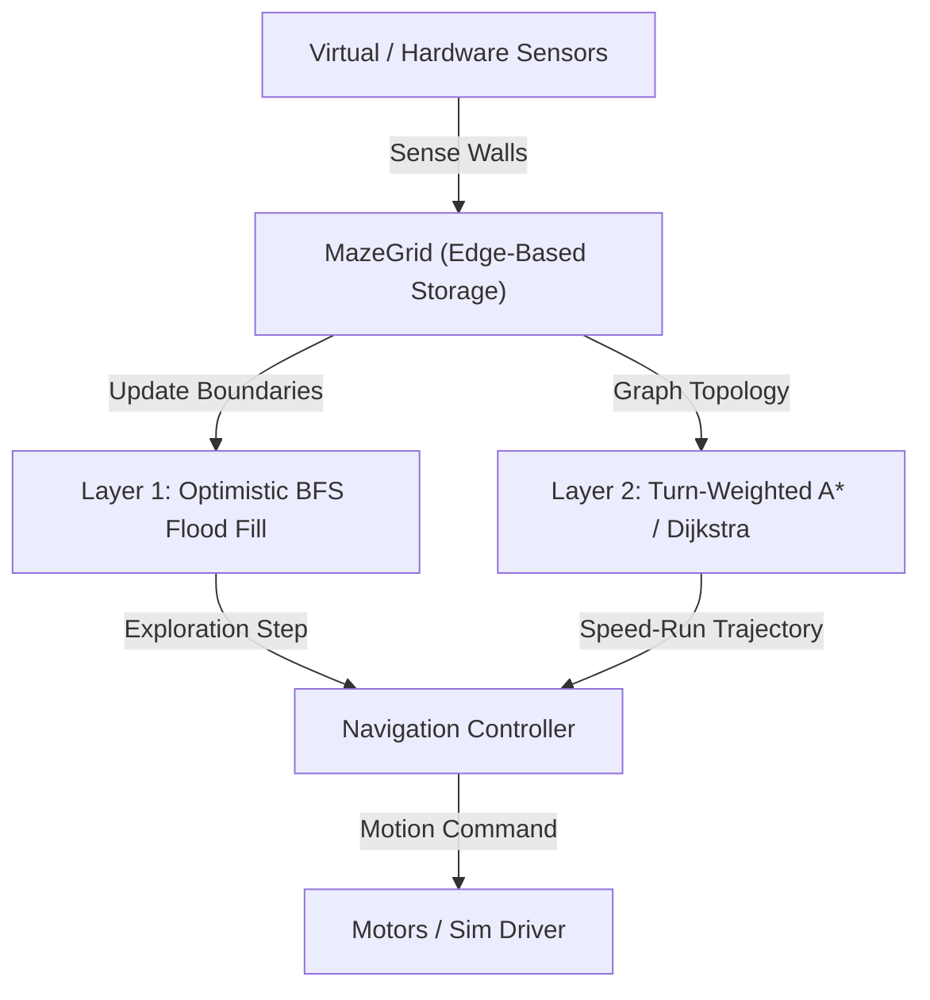

# Maze-Solver — MMRC26 Autonomous Micromouse Engine

> High-performance, deterministic maze solver engine and simulator for the 2026 HTU Micromouse Competition (MMRC26).

## Why It Exists

In the MMRC26 competition, final standing is governed by:

$$\text{Final Score} = \left(\frac{\text{Total Number of Successful Runs}}{\text{Official Time}}\right) \times 1000$$

With a continuous 8-minute (480-second) match window and an **Island Goal** configuration (where outer walls are completely detached from the center), traditional wall-following algorithms fail catastrophically. This repository provides a deterministic, two-layer algorithmic engine designed to:
1. Guarantee maze completion during the search run using **Optimistic Edge-Based Base Flood Fill**.
2. Compute the fastest physical trajectory using **Turn-Weighted State-Space Planning (Dijkstra / A\*)**.
3. Maximize repeat successful runs safely within the match time budget.
4. Maintain a strictly decoupled, zero-hardware-dependency architecture ready for direct embedded C/C++ porting.

## Quickstart

Get running in under 2 minutes:

```bash
# Clone and enter directory
cd Maze-Solver

# Run test suite
pytest -v

# Run lint and type checks
ruff check .
mypy maze_solver tests
```

## Commands

| Command | Action |
|---|---|
| `pytest -v` | Run full test suite with verbose output |
| `pytest --cov=maze_solver` | Run test coverage report |
| `ruff check .` | Run linter across all source files |
| `ruff format --check .` | Check formatting compliance |
| `ruff format .` | Auto-format Python code |
| `mypy maze_solver tests` | Run static type checker in strict mode |

## Architecture



### Directory Structure

```text
Maze-Solver/
├── config/                  # Global immutable parameters
│   └── settings.py
├── maze_solver/
│   ├── core/                # Pure navigation & algorithmic logic
│   │   ├── types.py         # Value types (Cell, Direction, Command)
│   │   ├── maze_grid.py     # Edge-based wall storage (single truth)
│   │   └── floodfill.py     # Layer 1 Base Flood Fill
│   └── simulator/           # Virtual environment & noise injection
├── tests/                   # Unit, property, and adversarial tests
├── docs/                    # Architectural design records and rules
└── .github/workflows/       # Automated CI pipeline
```

## Configuration

| Environment Variable | Description | Default | Example |
|---|---|---|---|
| `MAZE_SIM_SPEED` | Multiplier for simulator animation speed | `1.0` | `2.5` |
| `MAZE_LOG_LEVEL` | Logging verbosity (`DEBUG`, `INFO`, `WARNING`) | `INFO` | `DEBUG` |
| `MAZE_SEED` | Random seed for maze generation and noise | `42` | `1337` |

## License

Distributed under the [MIT License](LICENSE).
