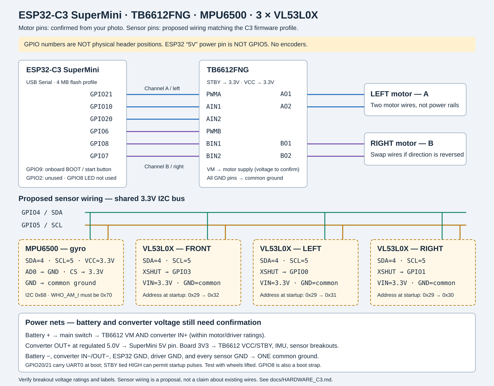

# روبوت الفريق — ESP32-C3 SuperMini



المؤكد من الفريق: `TB6612FNG`، لوحة `ESP32-C3 SuperMini`، ثلاث حساسات
`VL53L0X`، بدون Hall/encoders، قناة A يسار وقناة B يمين، و`STBY` على `3.3V`.
تم تفسير الاسم المكتوب `mbu6500` على أنه `MPU6500`؛ البرنامج يفحص هوية الشريحة
`WHO_AM_I=0x70`، ولا يقبل MPU6050 على أنه MPU6500.

## 1. المحركات — مطابقة للصورة

| TB6612FNG | التوصيل |
|---|---|
| PWMA | GPIO21 |
| AIN1 | GPIO10 |
| AIN2 | GPIO20 |
| AO1 / AO2 | سلكا المحرك اليسار |
| PWMB | GPIO6 |
| BIN1 | GPIO8 |
| BIN2 | GPIO7 |
| BO1 / BO2 | سلكا المحرك اليمين |
| VCC | 3.3V، لتغذية المنطق |
| STBY | 3.3V، حسب تأكيد الفريق |
| VM | تغذية المحركات؛ جهد البطارية وتصنيف المحركات لم يتأكدوا بعد |
| كل أرجل GND | الأرضي المشترك |

الموجب في `motors_set_speed` يعني حركة للأمام. جرّب والعجلات مرفوعة؛ إذا عجلة
عكست اتجاهها، بدّل سلكيها أو غيّر `LEFT_MOTOR_SIGN` / `RIGHT_MOTOR_SIGN` إلى `-1`.

## 2. الحساسات — توصيل مقترح يحتاج مطابقة مع الروبوت

| الإشارة | التوصيل |
|---|---|
| SDA للحساسات الأربعة | GPIO4 |
| SCL للحساسات الأربعة | GPIO5 |
| XSHUT الأمامي | GPIO3 |
| XSHUT اليسار | GPIO0 |
| XSHUT اليمين | GPIO1 |
| MPU6500 AD0 | GND، لاختيار عنوان 0x68 |
| MPU6500 CS / nCS | 3.3V، لاختيار I2C؛ بعض الموديولات توصلها داخلياً |
| MPU6500 VCC | 3.3V |
| VL53L0X VIN | 3.3V فقط على breakout يقبلها؛ راجع ملصق الموديول |
| GND للجميع | الأرضي المشترك |
| INT / GPIO1 على حساسات VL53L0X | غير مستخدمة |

**GPIO5 ليس رجل تغذية 5V، وGPIO0 ليس زر BOOT على C3.** زر BOOT هنا GPIO9.
الـ LED الموجود على GPIO8 لا يُستخدم لأنه نفس رجل BIN1. GPIO2 غير مستخدم.
كل أرقام الجدول GPIO؛ لا تعتمد على ترتيب أرجل لوحة ثانية.

عند الإقلاع، البرنامج يوقف الحساسات بـ XSHUT ثم يعطيهم العناوين:
أمامي `0x32`، يسار `0x31`، يمين `0x30`.
يجب أن يكون pull-up للـ SDA/SCL على 3.3V، وليس 5V.

## 3. التغذية

```text
Battery + -- Main switch --+--> TB6612 VM (motor-rated supply)
                           +--> Converter IN+
Battery - --------------------> Converter IN- / common GND
Converter OUT+ (5.0V) ----------> SuperMini 5V POWER pin
Converter OUT- ----------------> common GND
SuperMini 3V3 -----------------> TB6612 VCC + STBY + IMU + compatible ToF breakouts
Every GND ---------------------> common GND
```

جهد البطارية وخرج المحوّل بالصورة لم يتأكدوا. `5.0V` أعلاه **خرج مقترح** لتغذية
اللوحة؛ قِسه قبل التوصيل. لا توصل البطارية مباشرة إلى 3V3 أو إلى GPIO.
VM وVCC وظيفتان مختلفتان؛ لا تعتبرهما نفس التغذية.
عند توصيل USB للبرمجة، افصل تغذية 5V الخارجية ما لم تتأكد من عزل التغذيتين في لوحتك.

GPIO20/21 هما أيضاً UART0 أثناء الإقلاع، وGPIO8 من أرجل boot strapping.
مع STBY مثبت على 3.3V، قد تصل نبضات تشغيل قبل بدء البرنامج؛ ارفع العجلات في أول
تجربة، وتحقق من عدم الحركة عند التشغيل/reset. تعطيل UART في التطبيق وحده لا يلغي
رسائل ROM. إذا حصلت حركة، يجب مراجعة STBY أو توزيع الأرجل قبل التجربة على المتاهة.

## 4. البناء والتشغيل

```powershell
pio run -e esp32_c3_supermini
pio run -e esp32_c3_supermini -t upload
pio device monitor -b 115200
```

الهدف يستخدم `esp32-c3-devkitm-1` كتعريف عام لشريحة C3 ذات 4MB flash؛ خريطة
الأرجل في `config.h` مخصصة لـ SuperMini. USB Serial مفعّل، فلا يُستخدم UART0
لرسائل التطبيق لأن GPIO20/21 مستخدمة للمحركات.

للبناء بالبيئة المحلية المعزولة على Windows:

```powershell
$env:PLATFORMIO_CORE_DIR = "$PWD\.pio-core"
.\.venv\Scripts\python.exe -m platformio run -e esp32_c3_supermini
```

Arduino IDE: اختر لوحة ESP32-C3، فعّل USB CDC On Boot، وثبّت مكتبة Pololu
VL53L0X 1.3.1. تحديد ESP32-C3 يختار خريطة SuperMini تلقائياً في الـ sketch.

## 5. الحركة بدون encoders

- MPU6500 يثبت **زاوية الحركة**، وليس المسافة. ركّبه مستوياً، ومحور +Z للأعلى؛
  الدوران يميناً يجب أن يزيد heading. إذا انعكس، راجع `GYRO_Z_SIGN`.
- الحركة للأمام تعتمد على نقص المسافة إلى **نفس الجدار الأمامي** بمقدار 192mm،
  مع إبطاء آخر 60mm وتأكيد قراءتين بعد الفرملة، بدلاً من اعتبار timeout وصولاً.
- إذا الأمامي خارج المدى الموثوق `FRONT_REFERENCE_MAX_MM`، أو تبدّل المرجع،
  أو فشل I2C، تتوقف الحركة ولا يتقدم الموقع. هذا الوضع لا يضمن عبور كل متاهة:
  الممرات الطويلة أو الأسطح التي لا ترجع قياساً موثوقاً تحتاج حل قياس مسافة آخر.
- عاير على أرضية الروبوت الفعلية: `FRONT_WALL_STOP_MM`، `WALL_TARGET_SIDE_MM`،
  `MIN_PWM_DEADZONE`، `CELL_ARRIVAL_TOLERANCE_MM` وPD gains. قيّم المسافة
  فعلياً بالمسطرة بعد الحركة، وليس بمجرد وصول القراءة المستهدفة.
- سرعات PWM الحالية قيم بدء اختبار، ليست سرعات سباق مقاسة لهذا الروبوت.
  لا يُسجَّل run عند فشل الحركة، والموقع يُحدّث فقط عند نجاحها.

## 6. الاختبارات

```text
make -C firmware test
make -C firmware test-c3
python -m pytest -q
```

`test-c3` يختبر مسار ARDUINO الحقيقي للدرايفر/controller وقراءة MPU6500 مع
IO محاكى: اتجاهات PWM، الفرملة، تأكيد فرق المسافة، التعليق، هوية IMU وفشل I2C.
هذه اختبارات برمجية، وليست قياسات على الروبوت.
